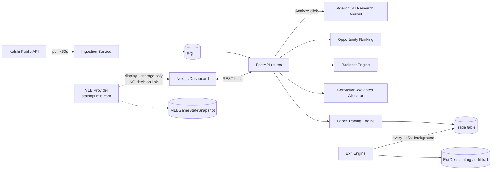

# Architecture

For a plain-language snapshot of what's shipped vs. in progress vs.
explicitly unvalidated, see [PROJECT_STATUS.md](./PROJECT_STATUS.md) — this
file describes how the pieces fit together; that one describes where each
piece currently stands.

## Scope so far

Kalshi market ingestion, AI research analysis, opportunity ranking,
backtesting, a paper-trading engine (bankroll + conviction-weighted
allocation + a modular exit engine), and an MLB live game-state data layer
are all built. The MLB layer is deliberately isolated from any decision it
could otherwise influence — see the dashed lines in the flow below. Data
collection + backtesting infrastructure (Phase 4) is planned next; an
ML/AI trading subsystem of any kind is deliberately not next. Real-money
trading has not been started.

## High-level flow

The dashed lines are intentional: the MLB data layer feeds the UI and its
own storage table, but has no edge into the exit engine, the allocator, or
any trade decision. That's a hard boundary, not a temporary gap — see
`PROJECT_STATUS.md` for why.

## Components

### Ingestion & data
- **Ingestion service** (`backend/app/services/ingestion.py` +
  `core/scheduler.py::run_ingestion_loop`): an `asyncio` loop, started in
  FastAPI's `lifespan`, that polls Kalshi's public `/events` endpoint
  (`with_nested_markets=true`) on an interval (default 60s), upserts
  `Market` rows, and appends a `PriceHistory` row whenever a market's price
  moves. No Kalshi API key required — public market data doesn't need auth;
  only order placement does, which stays out of scope.
- **Database** (`backend/app/database.py`, `backend/app/models/`):
  SQLAlchemy models — `Market`, `PriceHistory`, `Trade`,
  `MarketAnalysisRecord`, `ExitStrategySetting`, `ExitDecisionLog`. SQLite in
  development; `DATABASE_URL` swaps to Postgres with no code changes. No
  Alembic — new tables via additive `create_all`, new columns via manual
  non-destructive `ALTER TABLE`.

### Research & ranking
- **AI Analyst — Agent 1** (`backend/app/services/ai_analyst.py`): builds a
  prompt from a market's current price and recent history, calls OpenAI for
  a structured JSON response (probability, confidence, reasoning, risks,
  recommendation, suggested allocation), validated against a Pydantic schema
  before it reaches the API — a malformed response fails loudly rather than
  shipping partial data.
- **Opportunity ranking** (`backend/app/services/ranking.py`): scores a
  market 0–100 across liquidity, volatility, time-to-expiration, and
  AI-conviction components (each capped at 25 points), surfaced as a star
  rating with a full component breakdown (`OpportunityBreakdown.tsx`).
- **Signals** (`backend/app/services/signals.py`): simple, explicit
  price-pattern rules (e.g. "near a 20-period low, up 15%+ off it, YES <
  30¢") — pattern-based, never presented as a guarantee, and feeds both the
  UI's entry/exit badges and the backtesting engine below.

### Paper trading
- **Portfolio / paper trading engine** (`backend/app/services/portfolio.py`):
  a $1,000 simulated bankroll (`paper_trading_starting_balance`), buy/sell
  against live Kalshi prices, ROI/win-rate tracking, and
  `compute_position_metrics` — a pure-math `PositionMetrics` (ROI,
  probability change, expected value, momentum, risk score, peak
  price/P&L ratcheted since entry) deliberately kept separate from any exit
  *decision*.
- **Conviction-weighted allocator** (`backend/app/services/ai_analyst.py::allocate_batch`,
  exposed via `POST /api/portfolio/allocate`, `schemas/allocation.py`): sizes
  capital across a batch of candidate markets, skipping toss-ups below an
  edge/confidence threshold and redistributing their stake to stronger
  picks, rather than flat-sizing every bet equally.
- **Backtesting engine** (`backend/app/services/backtest.py`): replays a
  market's real Kalshi candlestick history and reports a signal-based
  strategy against buy-and-hold — win rate, max drawdown, an (unannualized,
  not cross-market-comparable) Sharpe ratio.

### Exit engine — experimental automation, on by default only to *observe*
- **Core** (`backend/app/services/exit_engine.py`): `evaluate_exit()` calls
  a single swappable `_ACTIVE_STRATEGY` reference — today, a flat-ROI
  strategy that holds below a threshold and, above it, still holds but flags
  an informational `PROFIT_MILESTONE_REACHED` milestone (a price crossing
  alone isn't evidence selling beats holding, so it's never itself a sell
  trigger). Output is a structured `ExitDecision`: `HOLD` / `SELL_PARTIAL` /
  `SELL_ALL`, confidence, urgency, reason codes, a summary.
- **Two modes** (`ExitStrategySetting`, switchable from the UI):
  `RECOMMEND_ONLY` (default) logs every evaluation and never acts;
  `AUTO_EXECUTE` (opt-in) additionally sells `SELL_ALL` recommendations that
  clear every safety check — minimum confidence, maximum auto-sell size,
  data-staleness window, and a per-cycle sell cap — logging exactly which
  check blocked it when one does (`AUTO_SKIP_LOW_CONFIDENCE`,
  `_SIZE_CAP`, `_STALE_DATA`, `_CYCLE_CAP`, `_ALREADY_CLOSED`).
- **Background loop** (`core/scheduler.py::run_exit_monitor_loop`): runs
  every `exit_monitor_interval_seconds` (default 45s) independent of the
  frontend or any browser tab being open.
- **Audit log** (`ExitDecisionLog`): every evaluation, executed or not —
  this is the dataset the not-yet-built validation step (compare logged
  `RECOMMEND_ONLY` decisions against hold-to-resolution and other simple
  baselines) will run against before `AUTO_EXECUTE` is trusted as anything
  more than an experiment. See `PROJECT_STATUS.md`.

### MLB live game-state (`backend/app/services/mlb/`)
- **Design constraint:** a pure data provider. It resolves a game, polls its
  state, displays it next to the Kalshi position, and stores it. Nothing
  about it feeds a buy/sell decision — `evaluate_exit()` has no dispatch
  branch for MLB and never receives the provider, cache, or any MLB model,
  so there's nothing there to wire in by accident.
- **Provider** (`provider.py`): `statsapi.mlb.com` — confirmed live (not
  scraping) as the same backend Gameday's own frontend calls; undocumented
  for third-party use, so it sits behind an `MLBProvider` Protocol rather
  than being called directly from anywhere else in the app.
- **Mapper** (`mapper.py`): pure function, raw live-feed JSON → `GameState`
  (`schemas/mlb.py`) — score, inning/half, outs, baserunners (statsapi marks
  an occupied base by the *presence* of a key, not a boolean), batter,
  the pitcher actually on the mound, last completed play, status.
- **Matcher** (`matcher.py`): resolves a `Market` to an MLB `gamePk` once,
  off the ticker's own concatenated team codes (e.g.
  `KXMLBGAME-26AUG061610DETSEA-DET`) — split against a verified static table
  of official MLB team codes and disambiguated by the ticker's pick segment,
  not by fuzzy title parsing. Persists to `MLBGameLink` and reuses it
  forever after; doubleheaders tie-break on closest game time to
  `Market.kalshi_open_time`; unresolved markets retry at most once/hour.
- **Cache** (`cache.py`): in-memory, per-process, keyed by `mlb_game_id`,
  replaced wholesale on update — safe without a lock because the
  background loops are cooperative `asyncio` tasks on one event loop, not
  real threads. Also tracks last-polled time and consecutive failures per
  game for the adaptive interval and graceful degradation below.
- **Polling loop** (`poller.py::run_mlb_poll_cycle` + `core/scheduler.py`):
  a third background task. Only polls games linked to markets with an
  **open position**, at most once per distinct game per cycle even when
  multiple markets reference it, on an adaptive interval by status (live
  ~30s, pregame ~5min, delayed/suspended ~2min, final → stops entirely). The
  only place in the app that makes an MLB network call; a slow or failing
  MLB API degrades gracefully (last-known state stays cached) and can never
  stall Kalshi ingestion or the exit-monitor loop.
- **Storage** (`MLBGameStateSnapshot`): one row per successful poll — the
  full game state plus the linked market's Kalshi prices at that same
  moment, structured columns rather than a JSON blob, built for exactly the
  kind of query Phase 4's backtesting needs.
- **Display**: an informational "Game" line in `PositionStatsRow.tsx`,
  composed at the route layer (`_attach_mlb_game_state` in
  `routes/portfolio.py`, reading only whatever the polling loop already
  cached) — explicitly separate from the exit engine's action badge, and
  omitted entirely rather than shown as a placeholder when no state is
  available yet.

### API (`backend/app/api/routes/`)
- `GET /api/markets`, `GET /api/markets/{ticker}`,
  `GET /api/markets/{ticker}/history`
- `POST /api/markets/{ticker}/analyze`, `GET /api/markets/{ticker}/analysis`
- `POST /api/markets/{ticker}/backtest`
- `GET /api/portfolio`, `POST /api/portfolio/trades`,
  `POST /api/portfolio/trades/{trade_id}/sell`
- `POST /api/portfolio/allocate`
- `GET /api/portfolio/exit-settings`, `PUT /api/portfolio/exit-settings`,
  `GET /api/portfolio/exit-log`
- `GET /api/health`

### Frontend (`frontend/`)
Next.js App Router. `/` is the market dashboard (`MarketTable.tsx`,
sortable); `/markets/[ticker]` (`MarketDetailLive.tsx`) composes the price
chart, opportunity breakdown, entry/exit signal callouts, the AI analysis
panel, the backtest panel, and the trade/position panels; `/portfolio`
(`PortfolioLive.tsx`) shows the bankroll, open/closed positions with
`PositionStatsRow` (metrics + exit-engine action badge), the
`ExitModeToggle`, and the full `ExitDecisionLog`.

## Roadmap

- **Now (Phase 4, planned):** data collection + backtesting infrastructure —
  systematic labeled price/feature history across markets (not just MLB),
  and the `RECOMMEND_ONLY`-log vs. hold-to-resolution/baseline comparison
  that actually tests whether the exit engine adds value, before
  `AUTO_EXECUTE` becomes anything more than an off-by-default experiment.
  Worth studying (not copying) as architecture references: a separate
  Kalshi research project doing short-horizon mixture-of-experts price
  prediction, and other open-source Kalshi systems' WebSocket feeds, market
  scanning, and risk-control patterns.
- **Then:** an ML/AI trading subsystem (BTC or otherwise) — deliberately
  comes after Phase 4's dataset exists, not before, and not yet scoped.
- **Later, gated:** optional real-money trading via Kalshi's authenticated
  (RSA-PSS signed) trading API, behind explicit user approval, risk limits,
  max position size, and an emergency stop — not started, and not a
  candidate to start until the phases above have real validation data
  behind them.
