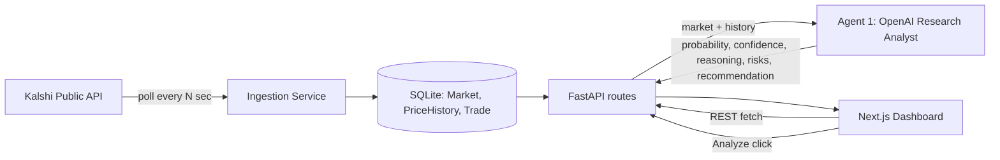

# Architecture

## Phase 1 scope

Connect to Kalshi's public market-data API, ingest and store markets + price
history, display them on a dashboard, and let a user select a market to get
an AI-generated research analysis (Agent 1: Research Analyst). No paper or
real trading happens yet.

## High-level flow

## Components

- **Ingestion service** (`backend/app/services/ingestion.py` + `core/scheduler.py`):
  an asyncio loop, started on FastAPI startup, that polls Kalshi's public
  `/markets` endpoint on an interval (default 60s), upserts `Market` rows,
  and appends a `PriceHistory` row whenever a market's price has moved.
  No Kalshi API key is required — public market data doesn't need auth;
  only order placement does, which is out of scope until a later phase.

- **Database** (`backend/app/database.py`, `backend/app/models/`): SQLAlchemy
  models for `Market`, `PriceHistory`, and `Trade`. SQLite in development;
  `DATABASE_URL` swaps to Postgres for production with no code changes.

- **AI Analyst — Agent 1** (`backend/app/services/ai_analyst.py`): builds a
  prompt from a market's current price and recent history, calls OpenAI for
  a structured JSON response (probability estimate, confidence, reasoning,
  risks, recommendation, suggested allocation), and validates it against a
  Pydantic schema before it ever reaches the API response — a malformed or
  incomplete AI response fails loudly instead of shipping partial data.

- **API** (`backend/app/api/routes/`): `GET /api/markets` (sortable by
  volume / movers / expiration / probability change), `GET /api/markets/{ticker}`,
  `GET /api/markets/{ticker}/history`, `POST /api/markets/{ticker}/analyze`.

- **Frontend** (`frontend/`): Next.js App Router dashboard (`/`) with a
  sortable market table, and a market detail page (`/markets/[ticker]`) with
  a Recharts price-history chart and an "Generate AI Analysis" panel that
  always shows reasoning, confidence, risks, and data sources alongside the
  recommendation — per the project's rule that AI output is never presented
  as ground truth.

## Roadmap (not built yet)

- **Phase 1.5** — Paper trading engine (Feature 4): buy/sell YES/NO against
  a simulated $100 bankroll, ROI/win-rate tracking. The `Trade` table already
  exists for this.
- **Phase 2** — Opportunity ranking/scoring (Feature 5), automated research
  agent (news/Reddit/sentiment), backtesting engine.
- **Phase 3** — Optional real-money trading via Kalshi's authenticated
  (RSA-PSS signed) trading API, gated behind explicit user approval, risk
  limits, max position size, and an emergency stop.
